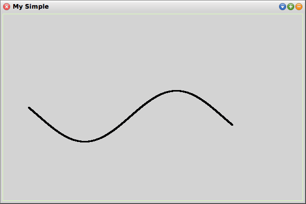

# 10-10-2017

## Excel/VBA Get Selected Row and Column
Used to get the active row.
```vb
' Get the selected row
Dim RowNum As Integer
RowNum = Target.Row

' Get the selected column
Dim ColNum As Integer
ColNum = Target.Column
```
Reference: https://msdn.microsoft.com/en-us/vba/excel-vba/articles/range-row-property-excel

## Smalltalk Custom Plot method
```smalltalk
DrawFunction: aBlockClosure  a: a b: b pen: pen 
	
	|y m X Y|
	a to: b by:0.1 do:  [:xx |
			x := xx.
			y := aBlockClosure value.
			m := xx asString, ' - ', y.
			X := 250 + xx.
			Y := 200 - y.
			pen place: X@Y.
			pen go: 0@0.
		].
```
Example usage:
```smalltalk
w := WindowMaker new.
w Create.

w NewImage.
p := w pen.
p color: Color black.

mf := MathFunctions new.
func := [((mf x * 3.14/180) sin) * 50].
mf DrawFunction: func
	a: -200
	b: 200
	pen: p.
w window changed.
```
Result:



## VBA Read Data from Text File
```vb
Open "File.txt" For Input As #1
Dim textline As String
Dim text As String
Do Until EOF(1)
    Line Input #1, textline
    text = text & textline
Loop
Close #1

' Display file contents in the Immediate Window.
Debug.Print text
```


## Links
* http://www.cuis-smalltalk.org/
* https://github.com/Cuis-Smalltalk/Cuis-Smalltalk-Dev
* https://github.com/Cuis-Smalltalk-Learning/Learning-Cuis/

[<< Previous (9-10-2017)](https://github.com/humayuns/Workspace/blob/master/Diary/2017/October/9/notebook.md) - 
[Next (11-10-2017) >>](https://github.com/humayuns/Workspace/blob/master/Diary/2017/October/11/notebook.md)