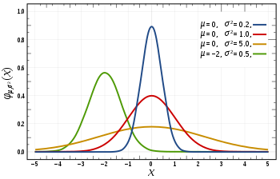

# 11-10-2017

## Parameterized ADO Query Using VBA
https://support.microsoft.com/en-us/help/181734/how-to-invoke-a-parameterized-ado-query-using-vba-c-java
```vb
Dim Conn1 As ADODB.Connection
Dim Cmd1 As ADODB.Command
Dim Param1 As ADODB.Parameter
Dim Rs1 As ADODB.Recordset

Dim i As Integer

' Trap any error/exception.
On Error Resume Next

' Create and Open Connection Object.
Set Conn1 = New ADODB.Connection
Conn1.ConnectionString = "DSN=Biblio;UID=admin;PWD=;"
Conn1.Open

' Create Command Object.
Set Cmd1 = New ADODB.Command
Cmd1.ActiveConnection = Conn1
Cmd1.CommandText = "SELECT * FROM Authors WHERE AU_ID < ?"

' Create Parameter Object.
Set Param1 = Cmd1.CreateParameter(, adInteger, adParamInput, 5)
Param1.Value = 5
Cmd1.Parameters.Append Param1
Set Param1 = Nothing

' Open Recordset Object.
Set Rs1 = Cmd1.Execute()
```

## VBScript RegEx AlphaNumeric
```vb
Set r = New RegExp
r.Pattern = "^[a-zA-Z0-9]*S"
```

## Normal Distribution VB
https://social.msdn.microsoft.com/Forums/en-US/3c7a351e-8a65-4146-b54d-5019758dfe5e/normal-distribution-function?forum=vbgeneral


```vb
Public Function NormDist(ByVal x As Double) As Double

      Dim t As Double
      Const b1 = 0.31938153
      Const b2 = -0.356563782
      Const b3 = 1.781477937
      Const b4 = -1.821255978
      Const b5 = 1.330274429
      Const p = 0.2316419
      Const c = 0.39894228

      If x >=0 Then
          t = 1.0# / (1.0# + p * x)
          NormDist = (1.0# - c * Math.Exp(-x * x / 2.0#) * t * (t * (t * (t *  (t * b5 +b4) + b3) + b2) + b1))
      Else 
          t = 1.0# / (1.0# - p * x)
         NormDist = (c * Math.Exp(-x * x / 2.0#) * t * (t * (t * (t *  (t * b5 +b4) + b3) + b2) + b1))
       End If
End Function
```

## Excel/VBA NORMINV function
https://support.office.com/en-us/article/NORMINV-function-87981ab8-2de0-4cb0-b1aa-e21d4cb879b8
```vb
'=NORMINV(A2,A3,A4)
Dim result As Double
result = WorksheetFunction.Norm_Inv(Probability, Mean, StandardDeviation)
```

## Excel/VBA Format Range
```vb
Sheet1.Range("A1").NumberFormat = "yyyy-mm-dd" ' Format as Date
Sheet1.Range("A1").NumberFormat = "@" ' Format as Text
```


## Links
* https://regex101.com/


[<< Previous (10-10-2017)](https://github.com/humayuns/Workspace/blob/master/Diary/2017/October/10/notebook.md) - 
[Next (12-10-2017) >>](https://github.com/humayuns/Workspace/blob/master/Diary/2017/October/12/notebook.md)