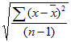

# 12-10-2017

## C# Format Number as Currency
MSDN: [String.Format Method](https://msdn.microsoft.com/en-us/library/system.string.format%28v=vs.110%29.aspx?f=255&MSPPError=-2147217396)
```csharp
Print(String.Format("{0:C}", 7.5));
// output: "$7.50"
```

## WorksheetFunction.StDev Method

```
expression . StDev( Arg1 , Arg2 , Arg3 , Arg4 , Arg5 , Arg6 , Arg7 , Arg8 , Arg9 , Arg10 , Arg11 , Arg12 , Arg13 , Arg14 , Arg15 , Arg16 , Arg17 , Arg18 , Arg19 , Arg20 , Arg21 , Arg22 , Arg23 , Arg24 , Arg25 , Arg26 , Arg27 , Arg28 , Arg29 , Arg30 )
```


# Group data in Google Spreadsheet


```
add this formula in A2:
=UNIQUE(Data!A2:A)

add the following formulas in B2 and C2 and copy down to B4 and C4 respectivey 
=SUM(FILTER(Data!$B$2:B;Data!$A$2:A=A2))
=COUNTA(FILTER(Data!$B$2:B;Data!$A$2:A=A2))
```
[Reference](https://webapps.stackexchange.com/questions/36103/how-to-group-data-in-a-google-spreadsheet)

## Links
* [JavaScript POC for a fully user-modifiable software system](https://github.com/d-cook/Objects)


[<< Previous (11-10-2017)](https://github.com/humayuns/Workspace/blob/master/Diary/2017/October/11/notebook.md) - 
[Next (13-10-2017) >>](https://github.com/humayuns/Workspace/blob/master/Diary/2017/October/13/notebook.md)