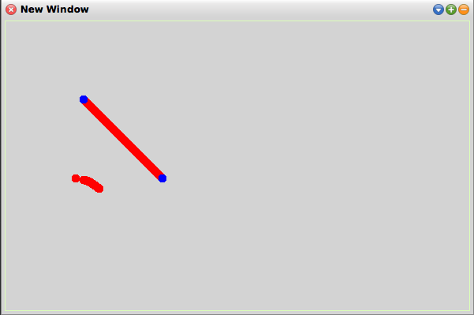

# 17-10-2017

## Squeak Dots and Lines

```smalltalk
wm := WindowMaker new.
wm Create.
w := wm window.

wm NewImage.
p := wm pen.
p roundNib: 10.

p color: (Color red).
x := 90.
y := 300 - ((x * (3.14/180)) sin * 100).

p place: x@y.
p go: 0@0.

x := 120.
100 to: x do: [:xx|
	y := 300 - ((xx * (3.14/180)) sin * 100).

	p place: xx@y.
	p go: 0@0.

	].


p place: 100@100.
p goto: 200@200.

p color:(Color blue).

p place: 100@100.
p go: 0@0.

p place: 200@200.
p go: 0@0.


w changed.
```


[◀ Previous (16-10-2017)](https://github.com/humayuns/Workspace/blob/master/Diary/2017/October/16/notebook.md) [▲](https://github.com/humayuns/Workspace/tree/master/Diary/2017/October)
[Next (18-10-2017) ▶](https://github.com/humayuns/Workspace/blob/master/Diary/2017/October/18/notebook.md)