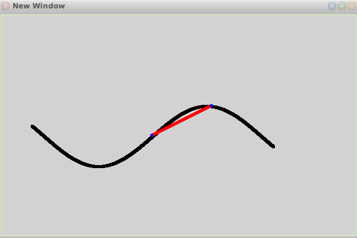

# 18-10-2017

## .NET: How do I find the PublicKeyToken for a particular dll?
Using PowerShell
```powershell
([system.reflection.assembly]::loadfile("c:\MyDLL.dll")).FullName
```
Using sn.exe
```
sn -T YourAssembly.dll
```

## Squeak Demo - Line between 2 points in a function

```smalltalk
DrawFunctionPointsLine: aBlockClosure a: a b: b pen: pen 
	
	|y X1 Y1 X2 Y2|

	x := a.
	y := aBlockClosure value.
	X1 := 250 + a.
	Y1 := 200 - y.
	
	x := b.
	y := aBlockClosure value.
	X2 := 250 + b.
	Y2 := 200 - y.
	
	"Line"
	pen place: X1@Y1.
	pen goto: X2@Y2.

	pen color: (Color blue).
	"First point."
	pen place: X1@Y1.
	pen go: 0@0.

	"Second point."
	
	pen place: X2@Y2.
	pen go: 0@0.
```

## Links
* http://xt1.org/scriptunit
* https://github.com/valeriofarias/vbsunit

[◀ Previous (17-10-2017)](https://github.com/humayuns/Workspace/blob/master/Diary/2017/October/17/notebook.md) [▲](https://github.com/humayuns/Workspace/tree/master/Diary/2017/October)
[Next (19-10-2017) ▶](https://github.com/humayuns/Workspace/blob/master/Diary/2017/October/19/notebook.md)