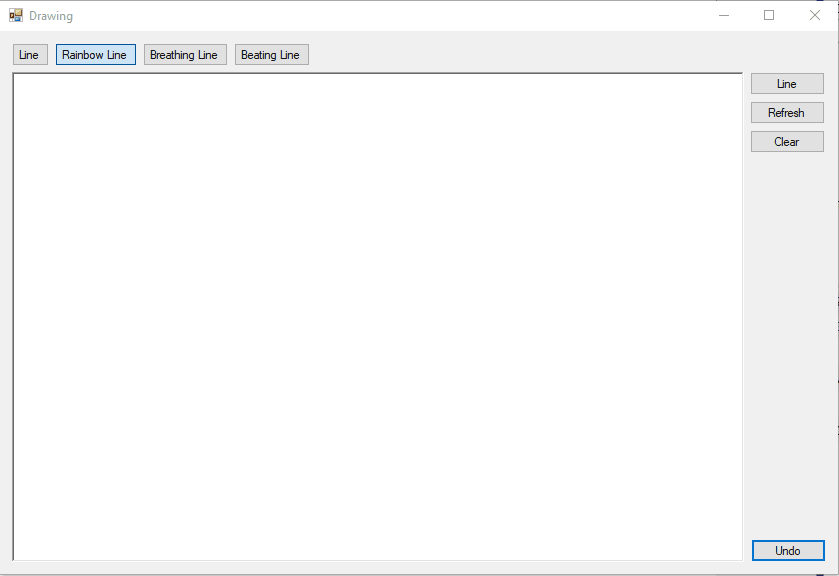

# 20-10-2017

## Python: Convert base-2 binary number string to int
```python
>>> int('11111111', 2)
255
```

## Pharo Smalltalk: How to create an input field using TextMorph?
```smalltalk
yourTextMorph := TextMorph new.
yourTextMorph contents: 'initial text'.
ownerMorph addMorph: yourTextMorph.
```

## Drawing Tool


## Links
* https://stackoverflow.com/questions/46833884/pharo-smalltalk-how-to-create-an-input-field-using-textmorph


[◀ Previous (19-10-2017)](https://github.com/humayuns/Workspace/blob/master/Diary/2017/October/19/notebook.md) [▲](https://github.com/humayuns/Workspace/tree/master/Diary/2017/October)
[Next (21-10-2017) ▶](https://github.com/humayuns/Workspace/blob/master/Diary/2017/October/21/notebook.md)