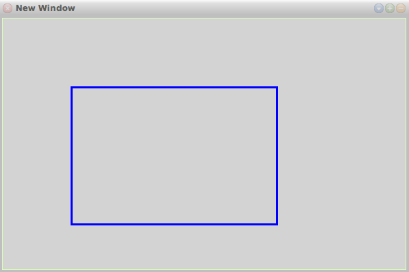

# 22-10-2017

## Smalltalk: Draw Rectangle using Pen
```smalltalk
RectangleAtX1: x1 Y1: y1 X2: x2 Y2: y2

	pen place: x1@y1.
	pen goto: x2@y1.
	pen goto: x2@y2.
	pen goto: x1@y2.
	pen goto: x1@y1.
```
Example:
```smalltalk
pf := PenFunctions new.
pf Pen:p.

pf RectangleAtX1: 100 Y1: 100 X2: 400 Y2: 300.
w changed. "Window changed"
```


## Smalltalk: Pen Dragon
```smalltalk
dragon: n  "Display restoreAfter: [Display fillWhite. Pen new dragon: 10]."
    "Display restoreAfter: [Display fillWhite. 1 to: 4 do:
        [:i | Pen new color: i; turn: 90*i; dragon: 10]]"
    "Draw a dragon curve of order n in the center of the screen."
    n = 0
        ifTrue: [self go: 5]
        ifFalse: [n > 0
            ifTrue: [self dragon: n - 1; turn: 90; dragon: 1 - n]
            ifFalse: [self dragon: -1 - n; turn: -90; dragon: 1 + n]]
```
Example:
```smalltalk
pen dragon: 8.
```


## Visual Basic: Print Numbers
```vb
Sub Main()

    PrintNumbers(1, 10)
    Console.ReadKey()

End Sub

Sub PrintNumbers(start As Integer, [end] As Integer)

    Console.WriteLine(start)
    If [end] > start Then
        PrintNumbers(start + 1, [end])
    End If

End Sub
```
Output
```
1
2
3
4
5
6
7
8
9
10
```

[◀ Previous (21-10-2017)](https://github.com/humayuns/Workspace/blob/master/Diary/2017/October/21/notebook.md) [▲](https://github.com/humayuns/Workspace/tree/master/Diary/2017/October)
[Next (23-10-2017) ▶](https://github.com/humayuns/Workspace/blob/master/Diary/2017/October/23/notebook.md)