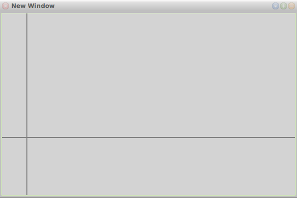

# 25-10-2017

## jQuery: Select all textboxes
```javascript
$("input:text")
```

## Smalltalk: Draw axis

```smalltalk
DrawAxis: window pen: pen

	pen color: Color gray.
	pen squareNib: 2.

	pen place: 50@0.
	pen goto: 50@400.

	pen place: 0@250.
	pen goto: 600@250.


```

## VB.NET: Check DBNull
```vb
If reader("field") Is DBNull.Value Then
    ' handle if it's null
else
    ' if not null
End If
```

```vb
If NOT IsDbNull(myItem("sID")) AndAlso myItem("sID") = sId Then
   'Do success
ELSE
   'Failure
End If
```
* https://stackoverflow.com/questions/222834/handling-dbnull-data-in-vb-net


[◀ Previous (24-10-2017)](https://github.com/humayuns/Workspace/blob/master/Diary/2017/October/24/notebook.md) [▲](https://github.com/humayuns/Workspace/tree/master/Diary/2017/October)
[Next (26-10-2017) ▶](https://github.com/humayuns/Workspace/blob/master/Diary/2017/October/26/notebook.md)