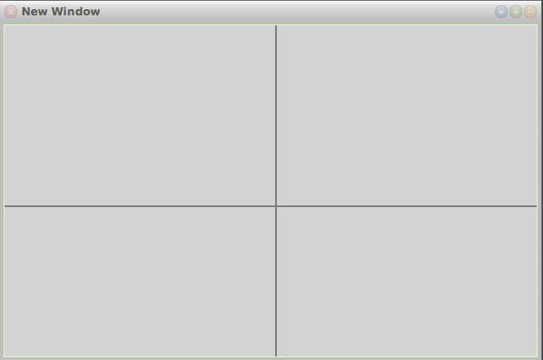

# 26-10-2017

## Smalltalk: Draw axis

```smalltalk
DrawAxis: window pen: pen

	|width height x1 x2 y1 y2|
	pen color: Color gray.
	pen squareNib: 2.

	width := window width.
	height := window height.
	
	x1 := width / 2.
	y1 := 0.
	
	x2 := x1.
	y2 := height.
		
	pen place: x1@y1.
	pen goto: x2@y2.

	x1 := 0.
	y1 := height / 2.
	
	x2 := width.
	y2 := y1.

	pen place: x1@y1.
	pen goto: x2@y2.
```

## ASP.NET: Redirect to current page
```vb
Response.Redirect(Request.RawUrl)
```


[◀ Previous (25-10-2017)](https://github.com/humayuns/Workspace/blob/master/Diary/2017/October/25/notebook.md) [▲](https://github.com/humayuns/Workspace/tree/master/Diary/2017/October)
[Next (27-10-2017) ▶](https://github.com/humayuns/Workspace/blob/master/Diary/2017/October/27/notebook.md)