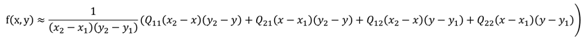

# 6-10-2017

## Emmet Examples


* [Emmet in Visual Studio Code](https://code.visualstudio.com/docs/editor/emmet)
* Emmet Cheat Sheet: https://docs.emmet.io/cheat-sheet/

`nav>ul>li`
```html
<nav>
    <ul>
        <li></li>
    </ul>
</nav>
```

`ul>li*5`
```html
<ul>
    <li></li>
    <li></li>
    <li></li>
    <li></li>
    <li></li>
</ul>
```

`!`
```html
<!DOCTYPE html>
<html lang="en">
<head>
    <meta charset="UTF-8">
    <meta name="viewport" content="width=device-width, initial-scale=1.0">
    <meta http-equiv="X-UA-Compatible" content="ie=edge">
    <title>Document</title>
</head>
<body>
    
</body>
</html>
```

## Unity 3D CharacterController.Move
A more complex move function taking absolute movement deltas.

Attempts to move the controller by motion, the motion will only be constrained by collisions. It will slide along colliders. CollisionFlags is the summary of collisions that occurred during the Move. This function does not apply any gravity.
```csharp
using UnityEngine;
using System.Collections;

public class ExampleClass : MonoBehaviour {
    public float speed = 6.0F;
    public float jumpSpeed = 8.0F;
    public float gravity = 20.0F;
    private Vector3 moveDirection = Vector3.zero;
    void Update() {
        CharacterController controller = GetComponent<CharacterController>();
        if (controller.isGrounded) {
            moveDirection = new Vector3(Input.GetAxis("Horizontal"), 0, Input.GetAxis("Vertical"));
            moveDirection = transform.TransformDirection(moveDirection);
            moveDirection *= speed;
            if (Input.GetButton("Jump"))
                moveDirection.y = jumpSpeed;
            
        }
        moveDirection.y -= gravity * Time.deltaTime;
        controller.Move(moveDirection * Time.deltaTime);
    }
}
```
**Reference:** https://docs.unity3d.com/2017.2/Documentation/ScriptReference/CharacterController.Move.html

## VBA Application.OnTime
Schedules a procedure to be run at a specified time in the future (either at a specific time of day or after a specific amount of time has passed).

```vb
' Example
Application.OnTime Now + TimeValue("00:00:15"), "my_Procedure"
```
Reference: https://msdn.microsoft.com/en-us/library/aa195809(office.11).aspx

## VBA TimeValue Function
Returns a Variant ( Date ) containing the time.
```vb
Dim MyTime
MyTime = TimeValue("4:35:17 PM")    ' Return a time.
```
Reference: https://msdn.microsoft.com/VBA/Language-Reference-VBA/articles/timevalue-function

## Timer on user form in Excel VBA

```vb
''//Here's the code that goes in the user form
Dim nextTriggerTime As Date

Private Sub UserForm_Initialize()
    ScheduleNextTrigger
End Sub

Private Sub UserForm_Terminate()
    Application.OnTime nextTriggerTime, "modUserformTimer.OnTimer", Schedule:=False
End Sub

Private Sub ScheduleNextTrigger()
    nextTriggerTime = Now + TimeValue("00:00:01")
    Application.OnTime nextTriggerTime, "modUserformTimer.OnTimer"
End Sub

Public Sub OnTimer()
    ''//... Trigger whatever task you want here

    ''//Then schedule it to run again
    ScheduleNextTrigger
End Sub

''// Now the code in the modUserformTimer module
Public Sub OnTimer()
    MyUserForm.OnTimer
End Sub
```
Reference: https://stackoverflow.com/questions/1562913/timer-on-user-form-in-excel-vba

## How to: Convert Strings into an Array of Bytes in Visual Basic

```vb
' Unicode Example
Function UnicodeStringToBytes(ByVal str As String) As Byte()
    Return System.Text.Encoding.Unicode.GetBytes(str)
End Function

' ASCII Example
Function AsciiStringToBytes(ByVal str As String) As Byte()
        Return System.Text.Encoding.ASCII.GetBytes(str)
End Function
```

## Excel/VBA root finding trough bisection

```vb
' Implementation?
```

## Excel VBA Bilinear interpolation


```vb
Public Function InterpolateXY(ByRef X As Range, ByRef Y As Range, ByRef XRange As Range, ByRef YRange As Range, ByRef ValueTable As Range) As Double
    Dim iCol As Long
    Dim iRow As Long
    Dim C1 As Double
    Dim C2 As Double
    Dim C3 As Double
    Dim C4 As Double
    Dim F1 As Double
    Dim F2 As Double
    Dim C5 As Double
    Dim C6 As Double
    
    'search X
    iCol = 1
    Do While X >= XRange(1, iCol).Value And (iCol < XRange.Columns.Count)
        iCol = iCol + 1
    Loop
    
    'search Y
    iRow = 1
    Do While Y >= YRange(iRow, 1).Value And (iRow < YRange.Rows.Count)
        iRow = iRow + 1
    Loop

    'if X or Y fall outside the table, the function result is an error value
    If (X < XRange(1, 1).Value) Or (X > XRange(1, iCol).Value) Or (Y < YRange(1, 1).Value) Or (Y > YRange(iRow, 1).Value) Then
        InterpolateXY = (1 / 0)
        Exit Function
    End If
    
    '4 data table points 'around' X and Y
    C1 = ValueTable.Cells(iRow - 1, iCol - 1).Value
    C2 = ValueTable.Cells(iRow - 1, iCol).Value
    C3 = ValueTable.Cells(iRow, iCol - 1).Value
    C4 = ValueTable.Cells(iRow, iCol).Value

    'X and Y fractions
    F1 = (X - XRange.Cells(1, iCol - 1).Value) / (XRange.Cells(1, iCol).Value - XRange.Cells(1, iCol - 1).Value)
    F2 = (Y - YRange.Cells(iRow - 1, 1).Value) / (YRange.Cells(iRow, 1).Value - YRange.Cells(iRow - 1, 1).Value)

    '2 intermediate results after interpolation on X
    C5 = C1 + F1 * (C2 - C1)
    C6 = C3 + F1 * (C4 - C3)
    
    'final result after interpolation on Y
    InterpolateXY = C5 + F2 * (C6 - C5)
    
End Function
```

## Smalltalk Creating a Morph

```smalltalk
"Create morph"
RectangleMorph new

"Create and show using openInWorld"
RectangleMorph new openInWorld
```
Reference: http://wiki.squeak.org/squeak/2197