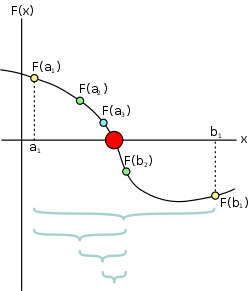

# 9-10-2017

## Bisection Method


Algorithm
```
INPUT: Function f, endpoint values a, b, tolerance TOL, maximum iterations NMAX
CONDITIONS: a < b, either f(a) < 0 and f(b) > 0 or f(a) > 0 and f(b) < 0
OUTPUT: value which differs from a root of f(x)=0 by less than TOL
 
N ← 1
While N ≤ NMAX # limit iterations to prevent infinite loop
  c ← (a + b)/2 # new midpoint
  If f(c) = 0 or (b – a)/2 < TOL then # solution found
    Output(c)
    Stop
  EndIf
  N ← N + 1 # increment step counter
  If sign(f(c)) = sign(f(a)) then a ← c else b ← c # new interval
EndWhile
Output("Method failed.") # max number of steps exceeded
```

## Writing Mathematic Fomulars in Markdown
```
\int_0^\infty \mathrm{e}^{-x}\,\mathrm{d}x

\to
```


## Links
* https://en.wikipedia.org/wiki/Bisection_method
* http://csrgxtu.github.io/2015/03/20/Writing-Mathematic-Fomulars-in-Markdown/