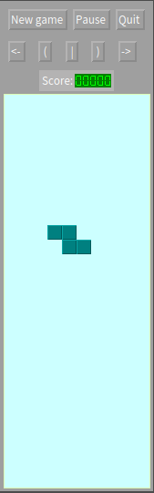

# 9-10-2017

## Bisection Method


Algorithm
```
INPUT: Function f, endpoint values a, b, tolerance TOL, maximum iterations NMAX
CONDITIONS: a < b, either f(a) < 0 and f(b) > 0 or f(a) > 0 and f(b) < 0
OUTPUT: value which differs from a root of f(x)=0 by less than TOL
 
N ← 1
While N ≤ NMAX # limit iterations to prevent infinite loop
  c ← (a + b)/2 # new midpoint
  If f(c) = 0 or (b – a)/2 < TOL then # solution found
    Output(c)
    Stop
  EndIf
  N ← N + 1 # increment step counter
  If sign(f(c)) = sign(f(a)) then a ← c else b ← c # new interval
EndWhile
Output("Method failed.") # max number of steps exceeded
```

## Writing Mathematic Fomulars in Markdown

```
\int_0^\infty \mathrm{e}^{-x}\,\mathrm{d}x

\to
```

## MathMorphs


## Squeak: Install Metacello

```smalltalk
"Get the Metacello configuration (for Squeak users)"
Installer gemsource
    project: 'metacello';
    addPackage: 'ConfigurationOfMetacello';
    install.

"Bootstrap Metacello Preview, using mcz files (#'previewBootstrap' symbolic version"
((Smalltalk at: #ConfigurationOfMetacello) project 
  version: #'previewBootstrap') load.

"Load the Preview version of Metacello from GitHub"
(Smalltalk at: #Metacello) new
  configuration: 'MetacelloPreview';
  version: #stable;
  repository: 'github://dalehenrich/metacello-work:configuration';
  load.

"Now load latest version of Metacello"
(Smalltalk at: #Metacello) new
  baseline: 'Metacello';
  repository: 'github://dalehenrich/metacello-work:master/repository';
  get.
(Smalltalk at: #Metacello) new
  baseline: 'Metacello';
  repository: 'github://dalehenrich/metacello-work:master/repository';
  load.
```

## Pharo: Tetris
A simple Tetris implementation. [Link](http://catalog.pharo.org/catalog/project/Tetris?_s=yoLwV9g2FUGYCA5C&_k=yr8IdgxXHNGn6k7R)


```smalltalk
"Install package"
Metacello new
	smalltalkhubUser: 'Pharo' project: 'MetaRepoForPharo40';
	configuration: 'Tetris';
	version: #stable;
	load.

"run new game"	
Tetris new openInWorld.
```

## Writing a Macro in LibreOffice Calc
Reference: http://www.debugpoint.com/2014/09/writing-a-macro-in-libreoffice-calc-getting-started/

```vb
REM  *****  BASIC  *****
sub hello_world

	dim document   as object
	dim dispatcher as object
	
	document   = ThisComponent.CurrentController.Frame
	dispatcher = createUnoService("com.sun.star.frame.DispatchHelper")
	
	dim args1(0) as new com.sun.star.beans.PropertyValue
	dim args2(0) as new com.sun.star.beans.PropertyValue
	
	args1(0).Name = "ToPoint"
	args1(0).Value = "$A$1"
	dispatcher.executeDispatch(document, ".uno:GoToCell", "", 0, args1())
	
	args2(0).Name = "StringName"
	args2(0).Value = "Hello World!"
	dispatcher.executeDispatch(document, ".uno:EnterString", "", 0, args2())

   msgbox "Completed!"
end sub
```

## Smalltalk Execute a block
```smalltalk
b := [Transcript show:'test'.].
b value.
```

## C# Set Image Rating
https://stackoverflow.com/questions/25380108/how-to-set-an-image-rating
```csharp
class Program
{
    static void Main(string[] args)
    {
        //0,1,2,3,4,5
        SetRating(0);
        SetRating(1);
        SetRating(2);
        SetRating(3);
        SetRating(4);
        SetRating(5);
    }

    private static void SetRating(short ratingValue)
    {
        short ratingPercentageValue = 0;
        switch (ratingValue)
        {
            case 0: ratingPercentageValue = ratingValue; break;
            case 1: ratingPercentageValue = ratingValue; break;
            default: ratingPercentageValue = (short)((ratingValue - 1) * 25); break;
        }

        string SelectedImage = @"d:\Trash\phototemp\IMG_1200.JPG";
        using (var imageTemp = System.Drawing.Image.FromFile(SelectedImage))
        {
            var rating = imageTemp.PropertyItems.FirstOrDefault(x => x.Id == 18246);
            var ratingPercentage = imageTemp.PropertyItems.FirstOrDefault(x => x.Id == 18249);

            rating.Value = BitConverter.GetBytes(ratingValue);
            rating.Len= rating.Value.Length;
            ratingPercentage.Value = BitConverter.GetBytes(ratingPercentageValue);
            ratingPercentage.Len = ratingPercentage.Value.Length;
            imageTemp.SetPropertyItem(rating);
            imageTemp.SetPropertyItem(ratingPercentage);
            imageTemp.Save(SelectedImage + "new" + ratingValue +".jpg");

        }
    }
}
```


## Links
* https://en.wikipedia.org/wiki/Bisection_method
* http://csrgxtu.github.io/2015/03/20/Writing-Mathematic-Fomulars-in-Markdown/
* http://www.dm.uba.ar/MathMorphs/
* https://github.com/dalehenrich/metacello-work
* http://www.opencobalt.net/
* :star: https://github.com/SquareBracketAssociates/SqueakByExample-english
* Speech to Text: https://www.ibm.com/watson/services/speech-to-text/
* http://www.debugpoint.com/libreoffice-basic-macro-tutorial-index/

**[<< Previous (8-10-2017)](https://github.com/humayuns/Workspace/blob/master/Diary/2017/October/8/notebook.md)
[Next (10-10-2017) >>](https://github.com/humayuns/Workspace/blob/master/Diary/2017/October/10/notebook.md)
**